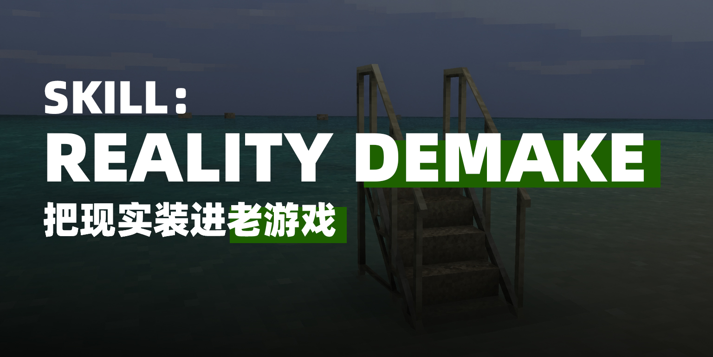
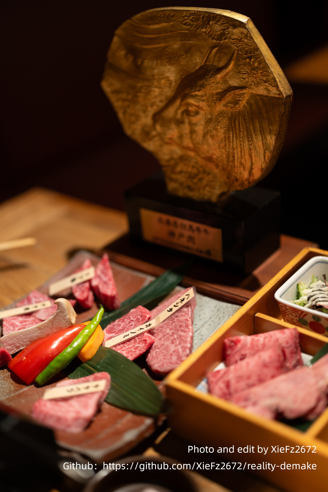
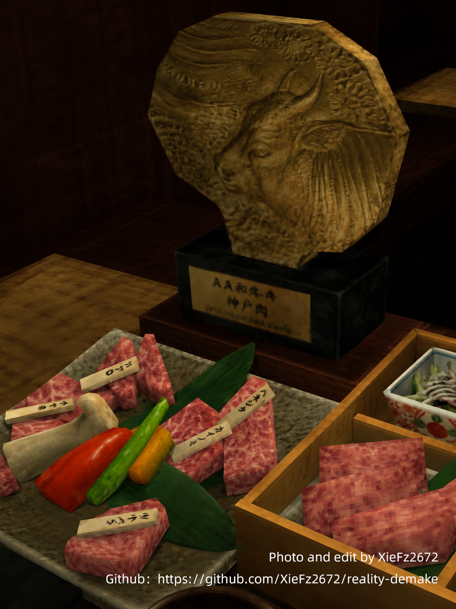
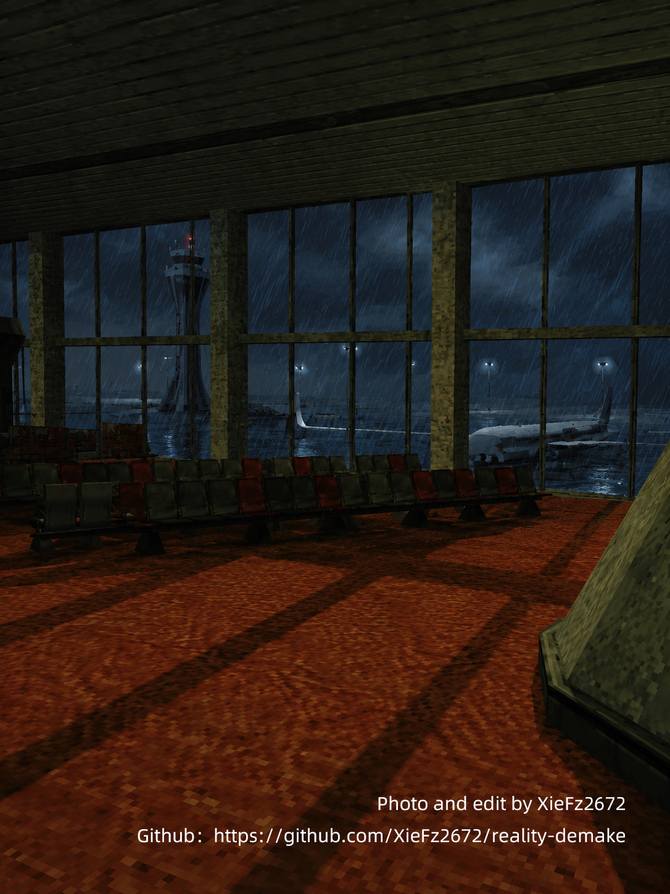
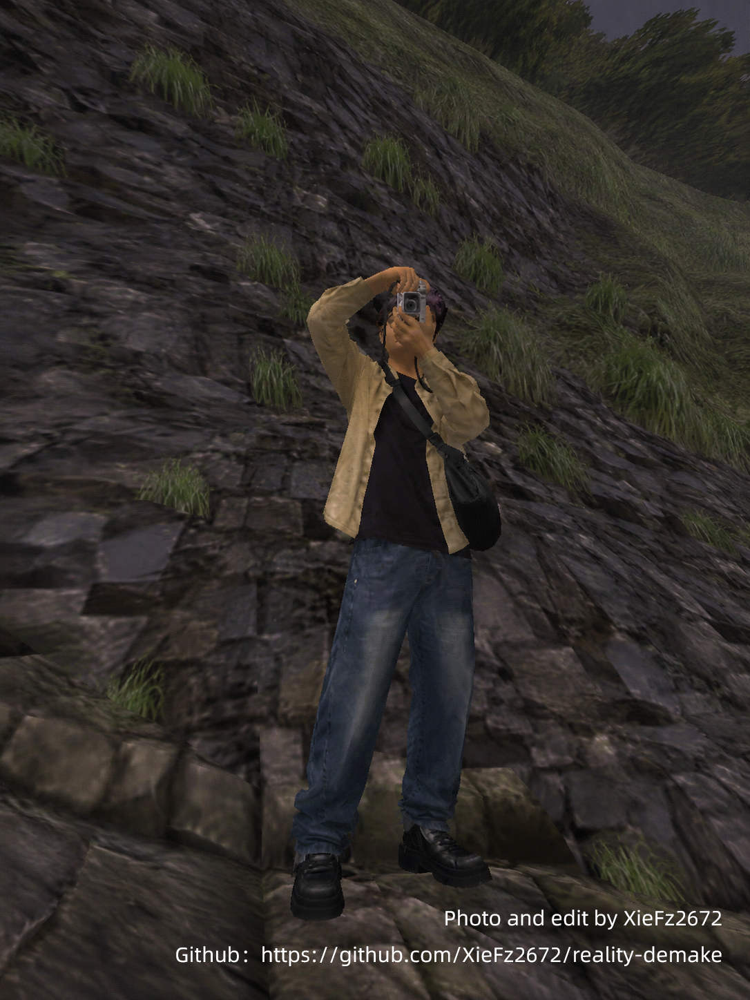

# Reality Demake
| 
> Remake real-world photos as 2004-era game screenshots — not a filter, but a demake.
> 把现实照片重新建模成 2004 年老游戏截图，不是滤镜，是降模。

---

**Reality Demake** is a free and open image-editing skill for turning real-world photos into early-2000s low-poly game screenshots.

It preserves the original subject, composition, viewpoint, and spatial layout, then rebuilds the scene with:

* low-poly geometry
* low-resolution textures
* stiff early-3D lighting
* old PC game atmosphere
* explorable game-map feeling

The goal is not to make a photo look blurry or pixelated.
The goal is to make reality feel rebuilt as an old game level.

---

## Examples

Add your before/after images to the `examples/` folder.

| Before                                                             | After                                                            |
| ------------------------------------------------------------------ | ---------------------------------------------------------------- |
|    |         

---

## Best For

This skill works best with photos that have clear spatial structure:

* streets
* parks
* malls
* convenience stores
* subway stations
* parking lots
* stairwells
* campuses
* travel photos with people in a full environment
* food or objects that can become game props

It is less suitable for close-up selfies, empty-background photos, heavily retouched portraits, or images that require exact text/logo preservation.
| Example1                                                            | Example2                                                            |
| ------------------------------------------------------------------ | ---------------------------------------------------------------- |
|    |      

---

## Quick Prompt

```text
Remake this photo as a 2004-era old-game screenshot — not as a filter, but as a full demake. Strictly preserve the subject, composition, viewpoint, pose, and spatial layout. Rebuild people, architecture, vegetation, roads, and objects as visible low-poly models with slightly blurry, dirty, repeated low-resolution textures and stiff early-game lighting. Reference the era and visual character of early Source Engine, Half-Life 2, and Garry’s Mod maps without copying specific characters, maps, or assets. Avoid modern PBR, cinematic rendering, anime, illustration, and pixelation filters. Keep people recognizable, preserve all key elements, and add no text.
```

For the full skill instructions, see:

```text
SKILL.en.md
```

---

## Intensity

* **Light** — keeps more original detail and visual polish.
* **Standard** — recommended default; clear low-poly and low-res game look.
* **Heavy** — rougher, lower-res, and closer to old custom maps or cheap asset packs.

---

## Troubleshooting

If the result still looks like a filtered photo, add:

```text
Do not preserve photographic surfaces. Rebuild the people, architecture, vegetation, roads, and objects as visible low-poly 3D models. Strengthen polygonal planes, hard silhouettes, low-resolution textures, and old-game asset character.
```

If the result looks too modern, add:

```text
Remove PBR, advanced reflections, depth-of-field, ray tracing, and cinematic lighting. Use rough low-resolution textures, stiff direct lighting, baked shadows, and cheap asset-pack quality.
```

---

## Photo Credits

Unless otherwise stated, all example photos in this repository were taken and edited by the project author. The demake outputs are generated as visual experiments based on the author’s own source images.

---

## Trademark Notice

“Source Engine,” “Half-Life 2,” and “Garry’s Mod” are referenced only to describe a visual era and rendering character. This project is not affiliated with, endorsed by, sponsored by, or connected to Valve, Facepunch Studios, or any other rights holder.

All trademarks belong to their respective owners.

---

## License

MIT License. Free to use, modify, and share with the original copyright and license notice retained.

---

## 现实太高清了，给它降个模

**Reality Demake** 是一个免费公开的图片处理 Skill，用来把现实照片重新建模成 2004 年左右的老游戏截图。

它会保留原图的主体、构图、视角和空间关系，再把画面重建成：

* 低多边形建模
* 低分辨率贴图
* 生硬的早期 3D 光影
* 旧电脑游戏截图质感
* 像可以走进去的老游戏地图

重点不是把照片变糊、变像素化。
重点是让现实像被拆成旧游戏资产后重新搭建了一遍。

---

## 效果示例

可以把前后对比图放进 `examples/` 文件夹。

| Before                                                             | After                                                            |
| ------------------------------------------------------------------ | ---------------------------------------------------------------- |
|    |         
---

## 适合什么照片

更适合有清晰空间感的照片：

* 街景
* 公园
* 商场
* 便利店
* 地铁站
* 停车场
* 楼梯间
* 校园
* 人物在完整环境里的旅行照
* 可以变成游戏道具的食物或物品

不太适合纯大头自拍、背景太空的照片、过度精修人像，以及需要精确还原小字或 Logo 的图片。
| Example1                                                            | Example2                                                            |
| ------------------------------------------------------------------ | ---------------------------------------------------------------- |
|    |      

---

## 快速 Prompt

```text
把这张照片重新建模成 2004 年左右的老游戏截图，不是滤镜，是降模。严格保留主体、构图、视角、姿势和空间布局，把人物、建筑、植物、道路和物体重建为明显的低多边形模型，使用略糊、略脏、略重复的低分辨率贴图和生硬、不自然的早期游戏光影。整体参考早期 Source 引擎、Half-Life 2 和 Garry’s Mod 地图的时代质感，但不要复制具体角色、地图或资产。不要现代 PBR、电影感、动漫、插画、像素化滤镜或新增文字；人物要保持可识别，关键元素不能丢失。
```

完整 Skill 说明见：

```text
SKILL.md
```

---

## 降模强度

* **轻度**：保留更多原图细节，更耐看。
* **标准**：默认推荐，低模和低清贴图都比较明显。
* **重度**：更粗糙、更低清，更像旧电脑游戏或自制地图。

---

## 常见修复

如果结果像滤镜，追加：

```text
不要保留真实摄影表面。把人物、建筑、植物、道路和所有物体重新构造成可见的低多边形 3D 模型，强化几何面、硬边轮廓、低清贴图和旧游戏资产感。
```

如果结果太像现代游戏，追加：

```text
移除 PBR、高级反射、景深、光线追踪和电影级灯光。使用更粗糙的低分辨率贴图、生硬直射光、烘焙阴影和廉价资产包质感。
```

---

## 图片作者声明

除特别说明外，本仓库中的所有示例照片均由项目作者拍摄并处理。降模结果基于作者本人拥有使用权的原始照片生成，仅作为视觉实验展示。

---

## 商标说明

“Source Engine”“Half-Life 2”“Garry’s Mod”等名称仅用于描述视觉时代与渲染特征。本项目与 Valve、Facepunch Studios 或其他相关权利方不存在隶属、授权、赞助或合作关系。

相关商标归各自权利人所有。

---

## 许可协议

本项目采用 MIT License。你可以免费使用、修改和分享，但请保留原始版权与许可声明。
